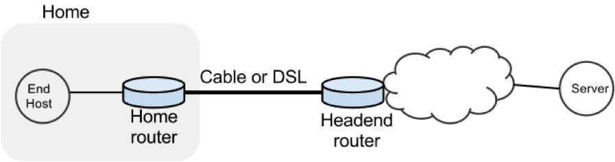
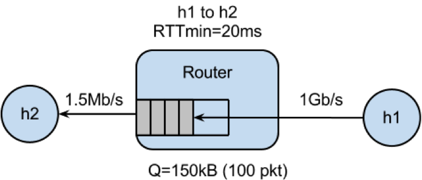
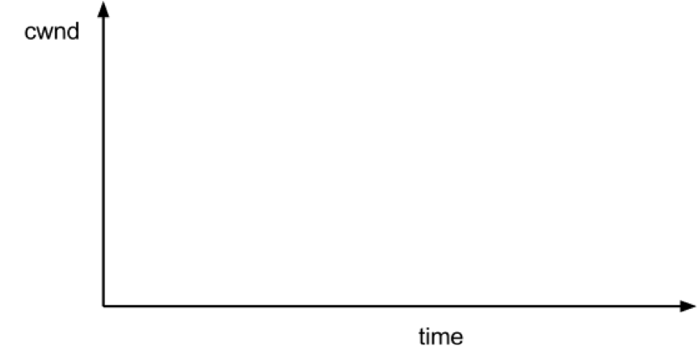
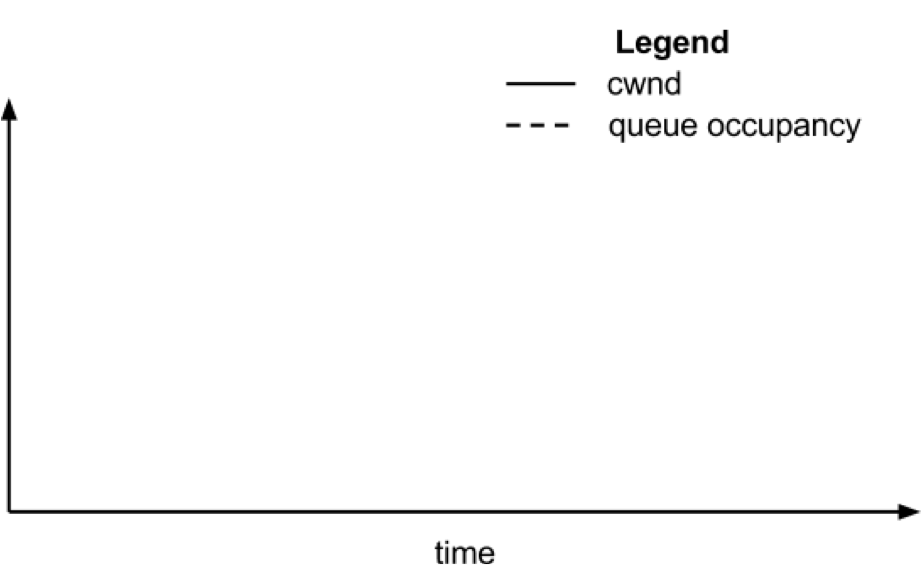

## Introduction

In this exercise we will study the dynamics of TCP in home networks. Take a look at the figure below which shows a “typical” home network with a Home Router connected to an end host. The Home Router is connected via Cable or DSL to a Headend router at the Internet access provider’s office. We are going to study what happens when we download data from a remote server to the End Host in this home network.



In a real network it’s hard to measure cwnd (because it’s private to the Server) and the buffer occupancy (because it’s private to the router). To make our measurement job easier, we are going to emulate the network in Mininet (See [[Environment Setup]] for setting up the environment).

The goals of the exercise are to:
 + Learn first-hand the dynamics of cwnd and buffer occupancy in a “real” network.
 + Learn why large router buffers can lead to poor performance in home networks. This problem is often called “Buffer Bloat.”
 + Learn how to use Mininet so you can repeat or extend the experiments in your own time.

## Part 1: Get Mininet up and running 


### Get the Bufferbloat Topology 
Bring up a terminal on your machine 
```no-highlight
> git clone https://bitbucket.org/huangty/cs144_bufferbloat.git
```
### Run the Mininet Emulator
```no-highlight
> cd cs144_bufferbloat/
> sudo ./run.sh 
```

### Measure the Delay Between the Two Hosts
After Mininet is running, you can measure the delay from H1 to H2 with the command: 
mininet> h1 ping -c 10 h2

## Part 2: Web page download - Sketch the TCP CWND

### Measure how long it takes to download a web page from H1
```no-highlight
mininet> h2 wget http://10.0.0.1
```
Answer: _________________ seconds

### Sketch how you think cwnd evolves over time at H1.  Mark multiples of RTT on the x-axis.


## Part 3: “Streaming video” - Sketch the TCP CWND and Buffer Occupancy.

### Create the Video Flow
To see how the dynamics of a long flow (which enters the AIMD phase) differs from a short flow (which never leaves slow-start), we are going to repeat Part 2 for a “streaming video flow”. Instead of actually watching videos on your machine, we are going to set up a long-lived high speed TCP connection instead, to emulate a long-lived video flow.  You can generate long flows using the _iperf_ command, and we have wrapped it in a script which you can run as follows: 
```no-highlight
mininet> h1 ./iperf.sh  
```

You can see the throughput of TCP flow from H1 to H2 by running:
```no-highlight
mininet> h2 tail -f ./iperf-recv.txt 
```
You can quit viewing throughput by pressing CTRL-C.

### The TCP CWND of the Video Flow
Sketch how you think cwnd evolves over time at H1. You might find it useful to use ping to measure how the delay evolves over time, after the iperf has started:
```no-highlight
mininet> h1 ping -c 100 h2
```


### The Impact on the Short Flow
To see how our long-lived iperf flow affects our web page download, download the webpage again - while iperf is running. Write down how long it takes.
```no-highlight
mininet> h2 wget http://10.0.0.1
```
Answer: _________________ seconds

### Why does the web page take so much longer to download?
Please write your explanation below.
Answer: 


## Part 4: Measuring the real cwnd and buffer occupancy values.
It turns out that Mininet lets you measure cwnd and buffer occupancy values.  A script is provided to dump the values of cwnd and buffer occupancy into files.  We’re going to re-run a couple of the experiments and plot the real values.

### Restart Mininet 
Stop and restart Mininet and the monitor script, then re-run the above experiment as follows.
```no-highlight
mininet> exit
bash# sudo ./run.sh
```

### Monitor TCP CWND and Buffer Occupancy in Mininet
In another bash terminal, go to cs144_bufferbloat directory and type the following giving a name for your experiment.
```no-highlight
bash# ./monitor.sh <EXP_NAME>
```
Don’t worry if you see “ERROR: Module tcp_probe does not exist in /proc/modules”, it just means this module is not previously loaded.
```no-highlight
mininet> h1 ./iperf.sh 
```
(wait for 70 seconds …)
```no-highlight
mininet> h2 wget http://10.0.0.1
```

Wait for the wget to complete, then stop the python monitor script followed by the instructions on the screen.  The cwnd values are saved in: 

*<EXP_NAME>_tcpprobe.txt* and the buffer occupancy in *<EXP_NAME>_sw0-qlen.txt*.

### Plot CWND and Queue Occupancy 
Plot the TCP cwnd and queue occupancy from the output file 
```no-highlight
bash# ./plot_figures.sh <EXP_NAME>
```
Adjust command line parameters to generate the figure you want. 

The script will also host a webserver on the machine and you can use the url the script provided to access to your figures if it is a remote machine w/ public IP. [Sample figures](http://yuba.stanford.edu/~huangty/cs144/). If you are unable to see the cwnd, ensure you run wget *after* you started the monitor.sh script.

By now you will have realized that the buffer in the Headend router is so large that when it fills up with iperf packets, it delays the short wget flow. Next we’ll look at two ways to reduce the problem.

## Part 5:  Make the router buffer smaller. Reduce it from 100 packets to 20 packets.

### Restart Mininet with small buffer
Stop any running Mininet and start Mininet again, but this time we will make the buffers 20 packets long instead:
```no-highlight
prompt> sudo ./run-minq.sh 
```
Let’s also run the monitor script on the side:
```no-highlight 
prompt> sudo ./monitor.sh <EXP_NAME>
```

### Repeat the steps in Parts 2 and 3:
```no-highlight
mininet> h2 wget http://10.0.0.1
mininet> h1 ping -c 10 h2
mininet> h1 ./iperf.sh
mininet> h1 ping -c 30 h2
mininet> h2 wget http://10.0.0.1
```

### What do you think the cwnd and queue occupancy will be like in this case?


### Plot CWND and Queue Occupancy 
Plot the figure for cwnd and queue occupancy, this time using the script “./plot_figures_minq.sh” 
```no-highlight
prompt> ./plot_figures_minq.sh
```

Then again, use the url to see your figures.[Sample figures](http://yuba.stanford.edu/~huangty/cs144/minq.html)

### Why does reducing the queue size reduce the download time for wget?
Please put your explanation below.
Answer:

## Different queues 
The problem seems to be that packets from the short flow are stuck behind a lot of packets from the long flow. What if we maintain a separate queue for each flow and then put _iperf_ and _wget_ traffic into different queues?

For this experiment, we put the iperf and wget/ping packets into separate queues in the Headend router. The scheduler implements fair queueing so that when both queues are busy, each flow will receive half of the bottleneck link rate. 


### Restart Mininet
Start Mininet again, but this time we will create two queues, one for each type of traffic.
```no-highlight
prompt> sudo ./run-diff.sh
```

### Repeat the steps in Parts 2 and 3
```no-highlight
mininet> h2 wget http://10.0.0.1
mininet> h1 ping -c 10 h2
mininet> h1 ./iperf.sh
mininet> h1 ping -c 30 h2
mininet> h2 wget http://10.0.0.1
```
You should see the ping delay (and the wget download time) doesn’t change much before and after we start the iperf. 
